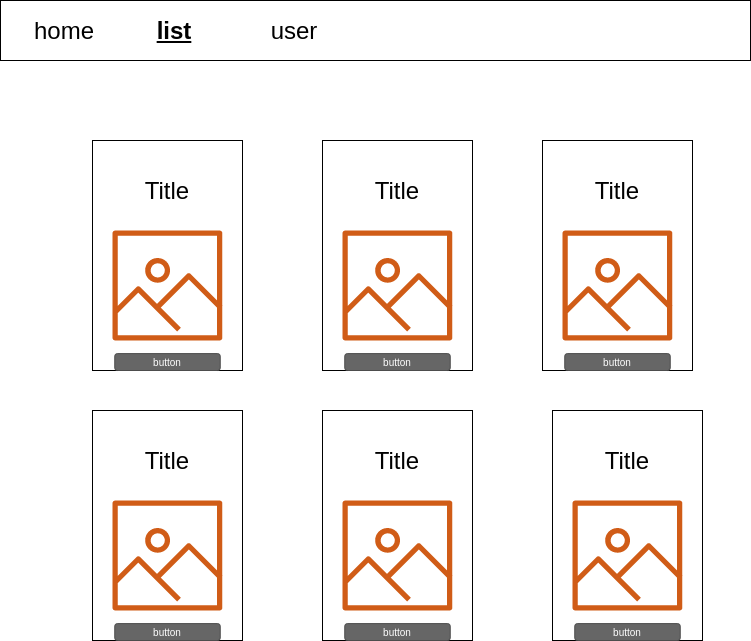

## Anime List App 
https://ranaalmalki.github.io/Anime-List/

### Technologies Used:

1. ReactJs
2. Axios
3. React Router
4. CSS (Cascading Style Sheets ).

### Wireframe:

### User Stories:
* As a user, I should be able to click on AnimeList nav to show list of the anime.
* As a user, I should be able to click on a button in anime list to add a new anime in my page.
* As a user, I should be able to remove one anime in my page.
* As a user, I should be able to delete All  my anime list .
* As a user, I should be able to  select specific anime and deleted.

### Development process :
At fisrt , i searched for Anime Api and is just take me 2 min to find Jikan Api then i create a new react app to start my code .

### Jikan Api:
https://jikan.docs.apiary.io/#introduction/information/wrappers
